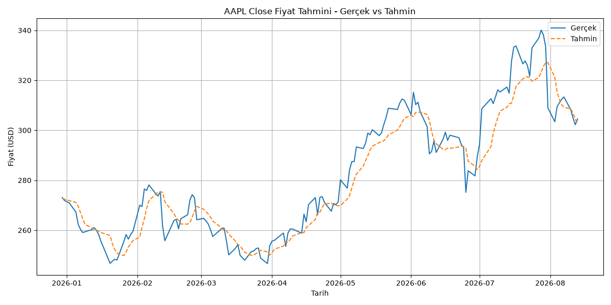

# Stock Price Prediction with PyTorch

10 hissenin (AAPL, MSFT, NVDA, META, PLTR, GOOGL, TTWO, TSLA, AMZN, AMD) geçmiş fiyat verileri kullanılarak, PyTorch ile geliştirilen LSTM (Long Short-Term Memory) ve GRU (Gated Recurrent Unit) modelleriyle bir sonraki günün kapanış (Close) fiyatını tahmin etmeyi amaçlayan bir zaman serisi projesi. Her hisse için hem LSTM hem GRU modeli ayrı ayrı eğitilir ve iki mimarinin performansı (RMSE/MAE/MAPE, eğitim süresi) karşılaştırılır. Eğitim ve çıkarım tamamen CPU üzerinde çalışacak şekilde tasarlanmıştır (GPU/CUDA gerektirmez).

## Özellikler

- **Veri çekme:** `yfinance` ile 10 hisse için son 5 yıllık günlük OHLCV (Open, High, Low, Close, Volume) verisi otomatik olarak indirilir.
- **Veri temizliği:** Eksik değer kontrolü ve doldurma, z-score tabanlı anormal fiyat sıçraması (outlier) tespiti.
- **Teknik indikatörler:** 7 günlük (MA7) ve 21 günlük (MA21) hareketli ortalama, günlük getiri (daily return).
- **PyTorch LSTM ve GRU modelleri:** Aynı iskelete sahip (2 katmanlı, dropout'lu, tamamen parametrik: hidden size, learning rate, epoch, batch size) `StockLSTM` ve `StockGRU` mimarileri.
- **LSTM vs GRU karşılaştırması:** Her hisse için her iki mimari de aynı hiperparametrelerle eğitilip test seti üzerinde RMSE/MAE/MAPE ve eğitim süresi bakımından karşılaştırılır.
- **Hiperparametre denemeleri:** Farklı learning rate / epoch / hidden size kombinasyonlarının train loss üzerinden karşılaştırılması.
- **Değerlendirme ve görselleştirme:** Test seti üzerinde RMSE/MAE/MAPE metrikleri ve gerçek vs. tahmin karşılaştırma grafiği.
- **Jupyter Notebook:** `notebooks/stock_prediction_analysis.ipynb`, tüm pipeline'ı (veri çekme, ön işleme, model mimarileri, eğitim, değerlendirme, LSTM vs GRU karşılaştırması) açıklamalı, tek bir anlatı akışında sunar.

## Kurulum

Python 3.12 gereklidir.

```bash
# Virtual environment oluştur
python -m venv venv

# Aktive et (Windows PowerShell)
venv\Scripts\Activate.ps1

# Bağımlılıkları kur (CPU tabanlı torch dahil)
pip install -r requirements.txt
```

## Kullanım

### Tüm hisseler için tek komutla (önerilen)

`src/run_all.py`, 10 hissenin hepsi için fetch → preprocess → prepare_dataset → train → evaluate → plot adımlarını sırayla, bilinen en iyi hiperparametrelerle (`learning_rate=0.0005`, `epoch=30`, `hidden_size=64`) otomatik çalıştırır ve sonunda tüm hisseleri karşılaştıran bir özet tablo üretir:

```bash
python src/run_all.py   # 10 hisse icin tum pipeline -> outputs/summary_results.csv
```

CPU üzerinde 10 hisse için birkaç dakika sürebilir.

### Tek bir hisse için adım adım

Her script `ticker` parametresi alır; script'ler `src/` klasöründe bulunur ve aşağıdaki sırayla çalıştırılmalıdır (varsayılan olarak `__main__` bloklarında `"AAPL"` kullanılır, farklı bir hisse için ilgili fonksiyonu kendi ticker'ınızla çağırabilirsiniz):

```bash
python src/fetch_data.py       # Tum TICKERS listesini indirir -> data/{TICKER}_raw.csv
python src/preprocess.py       # Temizler, MA7/MA21/daily_return ekler -> data/{TICKER}_processed.csv
python src/prepare_dataset.py  # Normalize eder, train/test split + LSTM sequence'ları oluşturur -> data/{TICKER}_X_train.npy, y_train.npy, X_test.npy, y_test.npy, scaler.pkl
python src/train.py            # Hiperparametre kombinasyonlarını dener, en iyi modeli kaydeder -> models/{TICKER}_lstm_model.pt / {TICKER}_gru_model.pt
python src/evaluate.py         # Test seti üzerinde RMSE/MAE/MAPE hesaplar
python src/plot_results.py     # Gerçek vs. tahmin grafiğini üretir -> outputs/{TICKER}_prediction_vs_actual.png
```

### Jupyter Notebook üzerinden

`notebooks/stock_prediction_analysis.ipynb`, `src/` altındaki tüm pipeline'ı (veri çekme, ön işleme, veri hazırlığı, model mimarileri, eğitim, değerlendirme, tüm hisseler için sonuçlar ve LSTM vs GRU karşılaştırması) açıklamalı olarak, tek bir anlatı akışında bir araya getirir. Notebook `src/` fonksiyonlarını import edip çağırır; script'lerdeki kodun bir kopyasını içermez.

```bash
jupyter notebook notebooks/stock_prediction_analysis.ipynb
```

## Proje Yapısı

```
stock-price-prediction/
├── data/                          # Ham/işlenmiş veri ve model girdileri (npy/pkl dosyaları git'e dahil değildir)
│   ├── {TICKER}_raw.csv           # yfinance'ten çekilen ham OHLCV verisi (ör. AAPL_raw.csv, MSFT_raw.csv, ...)
│   ├── {TICKER}_processed.csv     # Temizlenmiş veri + MA7, MA21, daily_return
│   ├── {TICKER}_X_train.npy / {TICKER}_y_train.npy
│   ├── {TICKER}_X_test.npy / {TICKER}_y_test.npy
│   └── {TICKER}_scaler.pkl        # O hisseye ozel fit edilmiş MinMaxScaler (tahminleri geri ölçeklemek için)
├── models/
│   ├── {TICKER}_lstm_model.pt     # Her hisse icin ayri egitilmiş LSTM model ağırlıkları
│   └── {TICKER}_gru_model.pt      # Her hisse icin ayri egitilmiş GRU model ağırlıkları
├── outputs/
│   ├── {TICKER}_prediction_vs_actual.png  # Her hisse icin gerçek vs. tahmin karşılaştırma grafiği
│   └── summary_results.csv        # 10 hisse x LSTM/GRU icin RMSE/MAE/MAPE/egitim suresi ozet karsilastirma tablosu
├── notebooks/
│   └── stock_prediction_analysis.ipynb  # Pipeline'in tamamini aciklamali sekilde birlestiren notebook
├── src/
│   ├── fetch_data.py              # yfinance ile 10 hisse icin veri çekme (TICKERS listesi)
│   ├── preprocess.py              # Veri temizliği ve teknik indikatörler (ticker parametreli)
│   ├── prepare_dataset.py         # Normalizasyon, train/test split, sequence windowing (ticker parametreli)
│   ├── model.py                    # StockLSTM ve StockGRU (PyTorch nn.Module) tanımları
│   ├── dataset.py                 # StockDataset ve DataLoader'lar (ticker parametreli)
│   ├── train.py                    # Training loop, hiperparametre denemeleri, train_and_save (ticker + model_type parametreli)
│   ├── evaluate.py                # Test seti değerlendirmesi (RMSE/MAE/MAPE, ticker + model_type parametreli)
│   ├── plot_results.py            # Gerçek vs. tahmin grafiği (ticker + model_type parametreli)
│   └── run_all.py                 # 10 hisse x LSTM/GRU icin tum pipeline'i otomatik calistirir, ozet tablo uretir
├── requirements.txt
└── README.md
```

## Sonuçlar

Her hisse için aynı hiperparametrelerle (`learning_rate=0.0005`, `epoch=30`, `hidden_size=64`) hem LSTM hem GRU modeli ayrı ayrı eğitilir. Test seti sonuçları, MAPE'ye göre en iyiden en kötüye sıralı (kaynak: `outputs/summary_results.csv`):

| Ticker | Model | RMSE ($) | MAE ($) | MAPE (%) | Eğitim Süresi (s) |
|---|---|---|---|---|---|
| AAPL | GRU | 5.82 | 4.32 | 1.52 | 18.7 |
| MSFT | GRU | 14.67 | 10.14 | 2.38 | 17.2 |
| AMZN | GRU | 8.00 | 5.83 | 2.45 | 16.8 |
| TSLA | GRU | 13.70 | 10.40 | 2.69 | 17.2 |
| TSLA | LSTM | 13.85 | 10.49 | 2.71 | 6.9 |
| TTWO | GRU | 8.49 | 6.49 | 2.95 | 17.1 |
| NVDA | GRU | 7.93 | 6.20 | 3.07 | 15.8 |
| META | GRU | 25.91 | 19.82 | 3.20 | 15.4 |
| AMZN | LSTM | 10.77 | 7.95 | 3.26 | 6.6 |
| MSFT | LSTM | 20.27 | 13.92 | 3.27 | 6.2 |
| AAPL | LSTM | 11.25 | 9.50 | 3.28 | 8.3 |
| GOOGL | LSTM | 14.42 | 11.29 | 3.36 | 7.1 |
| GOOGL | GRU | 15.17 | 11.76 | 3.37 | 16.4 |
| NVDA | LSTM | 8.67 | 7.23 | 3.72 | 6.2 |
| TTWO | LSTM | 11.10 | 8.75 | 4.01 | 6.3 |
| META | LSTM | 32.65 | 25.73 | 4.15 | 5.6 |
| AMD | LSTM | 24.09 | 17.53 | 4.79 | 6.4 |
| PLTR | GRU | 9.53 | 7.31 | 5.18 | 16.0 |
| PLTR | LSTM | 11.57 | 9.02 | 6.44 | 5.9 |
| AMD | GRU | 45.14 | 33.39 | 7.93 | 17.6 |

**Gözlem:** Model, AAPL, TSLA, AMZN, TTWO, MSFT ve NVDA gibi göreli olarak daha istikrarlı fiyat hareketine sahip hisselerde belirgin şekilde daha düşük hata veriyor (MAPE %2-3 civarı). Buna karşılık PLTR ve özellikle AMD gibi daha volatil, ani ve sert fiyat sıçramaları yaşayan hisselerde hata payı gözle görülür şekilde artıyor. Bu, modelin **hisse volatilitesine duyarlı** olduğunu gösteriyor: LSTM/GRU geçmiş fiyat hareketlerinden öğrendiği için, fiyatı daha öngörülebilir/trend takip eden hisselerde daha isabetli, ani rejim değişiklikleri yaşayan hisselerde ise daha isabetsiz tahminler üretiyor.

En iyi performans gösteren AAPL (GRU) için gerçek vs. tahmin grafiği:



### LSTM vs GRU Karşılaştırması

10 hissenin ortalaması alındığında:

| Model | Ortalama RMSE ($) | Ortalama MAE ($) | Ortalama MAPE (%) | Ortalama Eğitim Süresi (s) |
|---|---|---|---|---|
| LSTM | 15.86 | 12.14 | 3.90 | 6.5 |
| GRU | 15.44 | 11.57 | 3.48 | 16.8 |

**Genel sonuç:** **GRU**, 10 hissenin çoğunda (9/10) LSTM'den daha düşük hata veriyor ve ortalama MAPE'de LSTM'i geride bırakıyor (%3.48 vs %3.90). Ancak bu isabet artışının bir bedeli var: GRU, LSTM'e göre **yaklaşık 2.6 kat daha yavaş** eğitiliyor (~16.8s vs ~6.5s). **AMD bu genellemenin tek istisnası:** AMD'nin son dönemdeki sert ve hızlı fiyat sıçramaları nedeniyle GRU bu hissede LSTM'den belirgin şekilde daha kötü performans gösteriyor (MAPE %7.93 vs %4.79) — yani GRU'nun genel üstünlüğü, aşırı volatil hisselerde tersine dönebiliyor.

## Sınırlamalar / Geliştirme Fikirleri

- Model, fiyatlardaki **keskin dönüşlerde (ani yükseliş/düşüşlerde) gecikme (lag)** yaşıyor — bu, LSTM'lerin bir önceki değere yakın tahmin üretme eğiliminden kaynaklanan, zaman serisi modellerinde sık görülen bir davranış.
- Şu an 10 hisseyle sınırlı ve her hisse için **bağımsız bir model** eğitiliyor (paylaşılan/çoklu hisse öğrenmesi yok); daha geniş bir evrene veya farklı sektörlere genelleme test edilmedi.
- **GRU, genel olarak LSTM'den daha isabetli olsa da, bazı volatil hisselerde (ör. AMD) beklenmedik şekilde kötü performans gösterebiliyor** — yani mimari seçimi tek başına "her zaman daha iyi" bir cevap vermiyor, hisseye göre değişebiliyor.
- Ek **teknik indikatörler** (RSI, MACD, Bollinger Bantları, hacim tabanlı göstergeler vb.) eklenerek modelin daha fazla sinyal görmesi sağlanabilir.
- **Farklı model mimarileri** (Transformer tabanlı zaman serisi modelleri, çok değişkenli/çok hisseli modeller) denenebilir.
- Şu anki yaklaşım yalnızca **tek adım ileri (bir sonraki gün)** tahmin yapıyor; çok adımlı (multi-step) tahmin genişletilebilir.
- Haber/duyarlılık (sentiment) verisi gibi fiyat dışı sinyaller modele dahil edilmedi.
