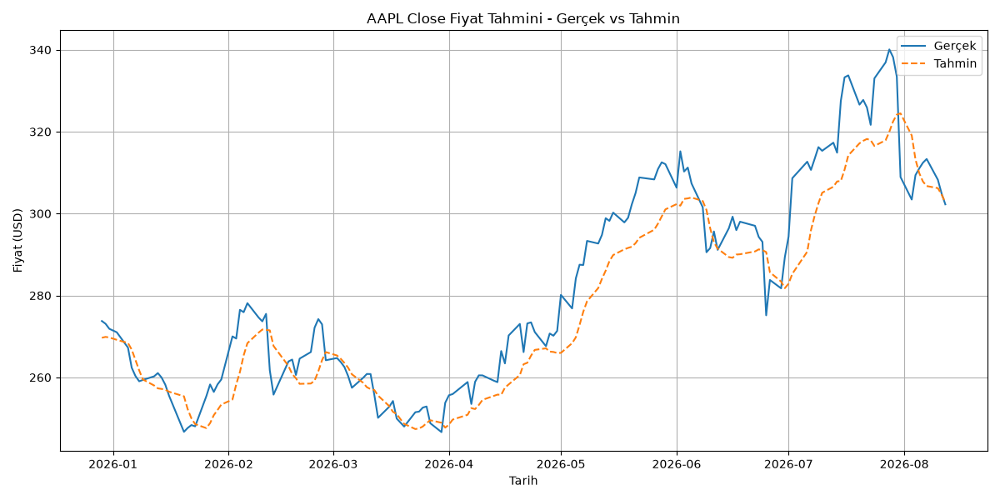

# Stock Price Prediction with PyTorch

AAPL (Apple) hisse senedinin geçmiş fiyat verileri kullanılarak, PyTorch ile geliştirilen bir LSTM (Long Short-Term Memory) modeliyle bir sonraki günün kapanış (Close) fiyatını tahmin etmeyi amaçlayan bir zaman serisi projesi. Eğitim ve çıkarım tamamen CPU üzerinde çalışacak şekilde tasarlanmıştır (GPU/CUDA gerektirmez).

## Özellikler

- **Veri çekme:** `yfinance` ile AAPL için son 5 yıllık günlük OHLCV (Open, High, Low, Close, Volume) verisi otomatik olarak indirilir.
- **Veri temizliği:** Eksik değer kontrolü ve doldurma, z-score tabanlı anormal fiyat sıçraması (outlier) tespiti.
- **Teknik indikatörler:** 7 günlük (MA7) ve 21 günlük (MA21) hareketli ortalama, günlük getiri (daily return).
- **PyTorch LSTM modeli:** 2 katmanlı, dropout'lu, tamamen parametrik (hidden size, learning rate, epoch, batch size) bir LSTM mimarisi.
- **Hiperparametre denemeleri:** Farklı learning rate / epoch / hidden size kombinasyonlarının train loss üzerinden karşılaştırılması.
- **Değerlendirme ve görselleştirme:** Test seti üzerinde RMSE/MAE/MAPE metrikleri ve gerçek vs. tahmin karşılaştırma grafiği.

## Kurulum

Python 3.12 gereklidir.

```bash
# Virtual environment oluştur
python -m venv venv

# Aktive et (Windows PowerShell)
venv\Scripts\Activate.ps1

# Bağımlılıkları kur (CPU tabanlı torch dahil)
pip install -r requirements.txt
```

## Kullanım

Script'ler `src/` klasöründe bulunur ve aşağıdaki sırayla çalıştırılmalıdır; her script bir öncekinin ürettiği veriye bağımlıdır:

```bash
python src/fetch_data.py       # AAPL verisini indirir -> data/aapl_raw.csv
python src/preprocess.py       # Temizler, MA7/MA21/daily_return ekler -> data/aapl_processed.csv
python src/prepare_dataset.py  # Normalize eder, train/test split + LSTM sequence'ları oluşturur -> data/X_train.npy, y_train.npy, X_test.npy, y_test.npy, scaler.pkl
python src/train.py            # Hiperparametre kombinasyonlarını dener, en iyi modeli kaydeder -> models/stock_lstm.pt
python src/evaluate.py         # Test seti üzerinde RMSE/MAE/MAPE hesaplar
python src/plot_results.py     # Gerçek vs. tahmin grafiğini üretir -> outputs/prediction_vs_actual.png
```

## Proje Yapısı

```
stock-price-prediction/
├── data/                      # Ham/işlenmiş veri ve model girdileri (npy/pkl dosyaları git'e dahil değildir)
│   ├── aapl_raw.csv           # yfinance'ten çekilen ham OHLCV verisi
│   ├── aapl_processed.csv     # Temizlenmiş veri + MA7, MA21, daily_return
│   ├── X_train.npy / y_train.npy
│   ├── X_test.npy / y_test.npy
│   └── scaler.pkl             # Fit edilmiş MinMaxScaler (tahminleri geri ölçeklemek için)
├── models/
│   └── stock_lstm.pt          # Eğitilmiş LSTM model ağırlıkları
├── outputs/
│   └── prediction_vs_actual.png  # Gerçek vs. tahmin karşılaştırma grafiği
├── notebooks/                 # Keşifsel analiz için ayrılmış klasör
├── src/
│   ├── fetch_data.py          # yfinance ile veri çekme
│   ├── preprocess.py          # Veri temizliği ve teknik indikatörler
│   ├── prepare_dataset.py     # Normalizasyon, train/test split, sequence windowing
│   ├── model.py                # StockLSTM (PyTorch nn.Module) tanımı
│   ├── dataset.py             # StockDataset ve DataLoader'lar
│   ├── train.py                # Training loop ve hiperparametre denemeleri
│   ├── evaluate.py            # Test seti değerlendirmesi (RMSE/MAE/MAPE)
│   └── plot_results.py        # Gerçek vs. tahmin grafiği
├── requirements.txt
└── README.md
```

## Sonuçlar

En iyi hiperparametre kombinasyonuyla (`learning_rate=0.0005`, `epoch=30`, `hidden_size=64`) eğitilen model, test seti üzerinde şu sonuçları vermiştir:

| Metrik | Değer |
|---|---|
| RMSE | $9.01 |
| MAE | $7.21 |
| MAPE | %2.48 |



## Sınırlamalar / Geliştirme Fikirleri

- Model, fiyatlardaki **keskin dönüşlerde (ani yükseliş/düşüşlerde) gecikme (lag)** yaşıyor — bu, LSTM'lerin bir önceki değere yakın tahmin üretme eğiliminden kaynaklanan, zaman serisi modellerinde sık görülen bir davranış.
- Şu an yalnızca **tek bir hisse (AAPL)** üzerinde çalışıyor; farklı hisselere veya sektörlere genelleme yeteneği test edilmedi.
- Ek **teknik indikatörler** (RSI, MACD, Bollinger Bantları, hacim tabanlı göstergeler vb.) eklenerek modelin daha fazla sinyal görmesi sağlanabilir.
- **Farklı model mimarileri** (GRU, Transformer tabanlı zaman serisi modelleri, çok değişkenli/çok hisseli modeller) denenebilir.
- Şu anki yaklaşım yalnızca **tek adım ileri (bir sonraki gün)** tahmin yapıyor; çok adımlı (multi-step) tahmin genişletilebilir.
- Haber/duyarlılık (sentiment) verisi gibi fiyat dışı sinyaller modele dahil edilmedi.
